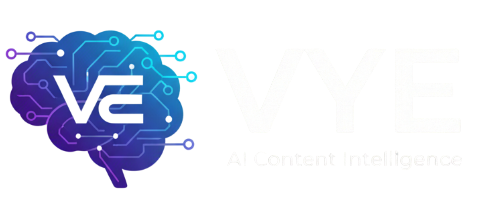

  

  <strong>An Intelligent Content Intelligence Platform powered by RAG Architecture.</strong>

---

## 🚀 Overview
**Vye** is an AI-powered assistant designed to transform the way we consume video content. Built on a **Retrieval-Augmented Generation (RAG)** framework, Vye allows users to "interact" with a vast knowledge base extracted from YouTube channels, providing deep insights, summaries, and strategic analysis with zero hallucinations.

## 🧠 Core Capabilities
* **Channel Brain Mode**: Queries the specific knowledge base of a channel using vector similarity search.
* **Deep Video Intelligence**: Analyzes speaker tone, sarcasm, and executive-level business strategies.
* **Competitor Arena**: Cross-references data and perspectives between different creators or topics.
* **Source Attribution**: Every response includes "Sources & Evidence" to ensure factual accuracy based on transcripts.
* **Responsive Interface**: Custom CSS-engineered UI that adapts perfectly to mobile and desktop screens.

## 🛠️ Technical Architecture
Vye processes long-form video transcripts into semantic chunks and stores them in a high-dimensional vector space.

* **LLM**: Google Gemini 2.5 Flash.
* **Vector Database**: Supabase with `pgvector`.
* **Embedding Model**: Gemini Embedding-001 (3,072 dimensions).
* **Knowledge Depth**: 3000+ Semantic chunks currently indexed.
* **Framework**: Streamlit for a fast, responsive web interface.

## ⚙️ Engineering Highlights
* **Rate-Limit Management**: Implemented customized "cooling down" periods and batch processing to optimize Google AI Studio's Free Tier limits.
* **Data Pipelines**: Automated transcript extraction and cleaning using `yt-dlp` before vectorization.
* **UI/UX Engineering**: Advanced CSS injection to handle Streamlit’s markdown containers for a modern chat experience.

   
  
   
  <h2 align="center">📽️ LIVE DEMO VIDEO</h2>
  
<strong>See Vye in action: Witness the RAG architecture processing real-time queries.</strong>

  
   
   
  

  <em>(Click the image or the button above to play the full technical demonstration)</em>

